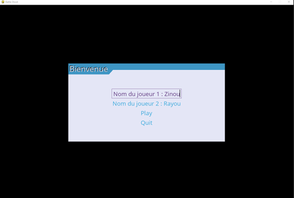
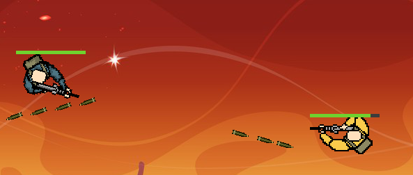
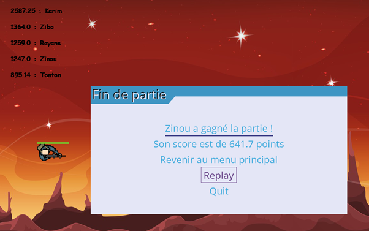
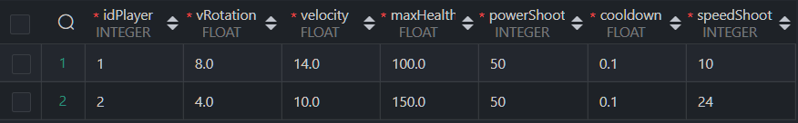

# Suivi Projet Dev

## Presentation

Grand Shooter is a 2D shooting game where the goal of the game is to destroy the opposing player. War is declared !

## Getting Started
### Install dependencies and launch the game

You have, in  the root project :
 - launch the terminal and type :
	 -  `pip install -r ./requirements.txt` *install dependencies*
	 -  ` <command_python> ./setup.py` *launch the game*

### How to play 

Tutorial in game

Once on the main menu, change the default username by selecting "Nom du joueur 1" and "Nom du joueur 2"

Press Play to launch your first game.

Press Quit to exit the software.

In a game, use the joystick of your controller to move the player, the X keys or A to shoot and the keys R1 L1 or Rb Lb for making your player rotate to the left or to the right.

When one of the player die a screen displays the winner of the game, his score and the five bests scorers on this arcade.

 -  "Revenir au menu principal" to return to main menu.
 - "Replay" to start a new game.
 - "Quit" button to exit the software.

## A database to edit the stats of the player
Need more speed or more power? You can customize your players's stats before playing. 
**WARNING :** Raising your stats too much can significantly lower your score.

